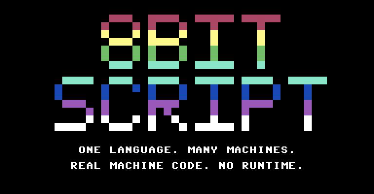
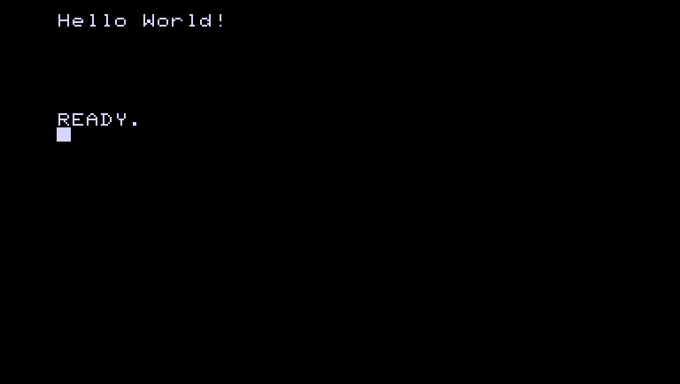
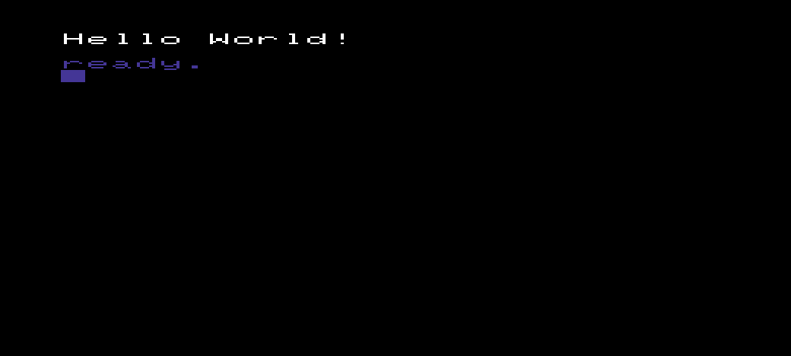
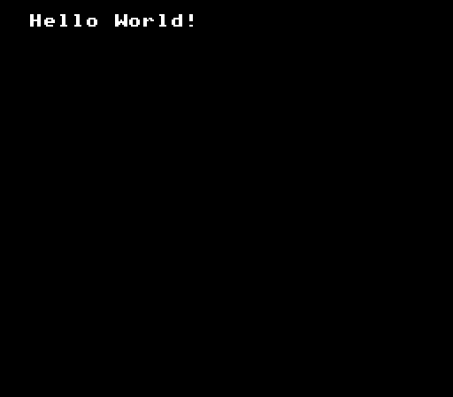
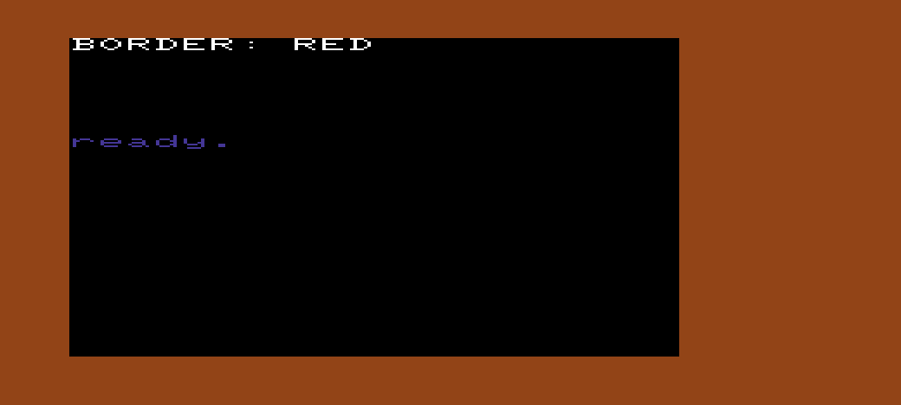
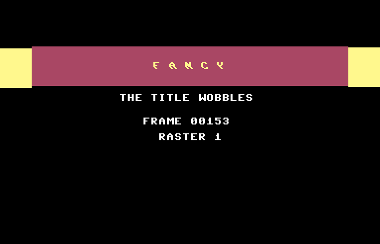
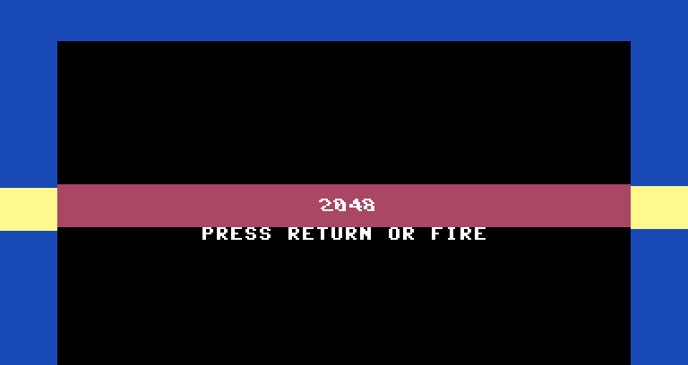

<p align="center">
  
</p>
<p align="center">
  <sub>That's not a mock-up. It's <a href=".github/readme/hero.8bs">one short 8BitScript program</a>, photographed on a Commodore 64.</sub>
</p>

<p align="center">
  <a href="https://github.com/8BitScript/8bitscript/releases"></a>
  <a href="LICENSE"></a>
  <a href="https://8bitscript.org/"></a>
</p>

> **Development version.** 8BitScript is a work in progress. A published release is a snapshot of ongoing work, and does not mean the language or the toolchain is finished.

# 8BitScript

**Remember when a computer switched on and was simply *ready*?**

No boot screen. No update. No twelve megabytes of runtime between you and
the metal. You typed, it did. 8BitScript is a programming language for
those machines — the Commodores, the Ataris, the NES — written the way you
write today, compiled into the honest 6502 machine code they've always
wanted. And the very same program builds for the web, so your friends
without a VIC-20 can play too.

It looks like TypeScript. It compiles like C. It runs like it was written
in 1983 by someone who really knew the chip.

## Why you'll want one

**WRITE IT ONCE. RUN IT ON EVERY MACHINE.**
`screen`, `text`, and `input` are the same calls on every target, and each
one resolves to that machine's own hand-tuned implementation at build time.
No `#ifdef`. No lowest-common-denominator. Your source never has to
mention which computer it's on.

**REAL MACHINE CODE. YOU PAY FOR WHAT YOU WRITE.**
No interpreter. No garbage collector. No heap. Every array and string is
laid out at compile time and the build tells you exactly what it cost:

```
memory: 0 bytes of RAM for variables, 188 bytes of program (code and data)
```

That's Hello World on a VIC-20. If a program won't fit, the build says so
— and says by how many bytes.

**THE COMPILER CATCHES IT BEFORE THE MACHINE DOES.**
Eight fixed-width integer types, range-checked while you type:

```ts
let score: u8 = 300;
```
```
error 8BS1021: 300 does not fit in u8 (0..255)
```

**NO ASSEMBLY REQUIRED. (UNLESS YOU WANT TO.)**
`asm6502 { … }` blocks, `@address` registers, and `memory.write` are part
of the language, not a trapdoor. Drop to the chip in the middle of a
function whenever the hardware deserves it.

**IT KNOWS WHAT IT'S RUNNING ON.**
`#fact(video.raster)` is answered at compile time, so a raster-bar effect
guarded by it costs the PET exactly zero bytes — and the C64 gets the
whole show.

**THE BROWSER IS A TARGET, NOT A COMPROMISE.**
The web build honours the same memory model and the same 8-bit arithmetic
as the native one. What wraps on the C64 wraps in Chrome.

## Look how little it takes

**Hello, World.** One file. Every machine. Zero edits.

```ts
import { screen } from "@8bitscript/screen";
import { text } from "@8bitscript/text";

export function main(): void {
    screen.blank();
    text.print(0, "Hello World!");
    text.releaseCursor();
}
```

```
$ 8bs run c64
```

<p align="center">
  
  
  <br>
  
  
  <br>
  <sub>PET · VIC-20 · C64 · NES — the same file, four builds, straight out of the emulators.</sub>
</p>

**A game loop.** Tap left or right — keyboard, joystick, or pad, whichever
the machine has — and an `8` steps along the top row.

```ts
import { screen } from "@8bitscript/screen";
import { text } from "@8bitscript/text";
import { input } from "@8bitscript/input";

let x: utinyint = 20;

export function main(): void {
    screen.blank();
    input.begin();
    while (true) {
        waitFrame();            // one tick of the machine's own refresh
        input.poll();           // keyboard, joystick, or pad — whatever's plugged in
        text.print(x, " ");
        if (input.left() && x > 0) { x--; }
        if (input.right() && x < text.COLUMNS - 1) { x++; }
        text.print(x, "8");
    }
}
```

**Talk to the chip.** Every VIC-20 owner learned `POKE 36879` in week one —
it's the screen and border colour. Here it is the 8BitScript way, then
the assembler's way:

```ts
import { screen } from "@8bitscript/screen";
import { text } from "@8bitscript/text";

export function main(): void {
    screen.blank();
    memory.write(36879, 10);    // POKE 36879,10 — the VIC-20's screen and border colour
    text.print(0, "BORDER: RED");
    asm6502 {                   // or say it to the chip yourself
        lda #10
        sta $900F
    }
}
```

```
$ 8bs run vic20
```

<p align="center">
  
</p>

Every one of these builds as shown. Try them in the
[manual](https://8bitscript.org/language/), where each entry is one thing
you can do, with the real code.

## See what it can do

<p align="center">
  
  
  <br>
  <sub>Left: a per-scanline raster effect, driven from portable code. Right: 2048, a whole game, on the C64.</sub>
</p>

[**2048**](https://github.com/8BitScript/2048) is the reference game —
one program that builds, runs, and plays on all nine machines. It's how
we know the language works. Clone it, run it, read it.

## Available now

Nine machines. Every one of them builds, runs, and renders today.

| | Machine | Year | Target |
| --- | --- | --- | --- |
| 🟩 | Commodore PET | 1977 | `pet` |
| 🟩 | Atari 8-bit (400/800/XL/XE) | 1979 | `atari8` |
| 🟩 | Commodore VIC-20 | 1980 | `vic20` |
| 🟩 | Commodore 64 | 1982 | `c64` |
| 🟩 | Nintendo Entertainment System | 1983 | `nes` |
| 🟩 | Commodore 128 | 1985 | `c128` |
| 🟩 | Commander X16 | 2020s | `cx16` |
| 🟩 | MEGA65 | 2022 | `mega65` |
| 🟩 | Your web browser (WebAssembly) | now | `web` |

## Coming attractions

Researched and written up, not yet built. Nothing here compiles today;
the [roadmap notes](https://8bitscript.org/project/machines/) say exactly
what's known about each and what's still to verify.

| | Machine | Notes |
| --- | --- | --- |
| 🟨 | Apple II family | 6502 — next in line |
| 🟨 | Commodore Plus/4, C16, C116 | 6502 — next in line |
| 🟨 | BBC Micro | 6502 — next in line |
| 🟨 | Oric-1 / Atmos | 6502 — next in line |
| ⬜ | Atari 5200 | 6502 console |
| ⬜ | Atari Lynx | 6502 handheld |
| ⬜ | PC Engine / TurboGrafx-16 | 6502-derived |
| ⬜ | Watara Supervision | 6502 handheld |
| ⬜ | Atari 2600 | the hard one |
| ⬜ | Game Boy / Game Boy Color | a second CPU backend |
| ⬜ | ZX Spectrum, MSX, Master System / Game Gear, Amstrad CPC, ColecoVision | the Z80 family |

🟩 builds today &nbsp;·&nbsp; 🟨 up next &nbsp;·&nbsp; ⬜ on the drawing board

## Get yours today

Sixty seconds to a running game — the toolchain, the emulators, and 2048:

```sh
git clone https://github.com/8BitScript/2048.git && cd 2048
pnpm install
pnpm exec 8bs doctor    # checks Node, pnpm, and the emulators; offers to install what's missing
pnpm start:c64          # builds and boots it in the real thing (well, VICE)
pnpm start:web          # the same game, in a browser tab
```

Your own program is a folder with a `package.json`, the CLI, one config
file, and a `main()`:

```sh
pnpm add -D @8bitscript/cli
```

```ts
// 8bitscript.config.ts
export default {
  entry: 'src/main.8bs',
  targets: { c64: {}, vic20: {}, web: {} },
};
```

```sh
pnpm exec 8bs run c64
```

Everything else — [project config](https://8bitscript.org/config), every
command, the standard packages, `.8bx` components, embedding the web
build in a page — lives at
**[8bitscript.org](https://8bitscript.org/)**. That's the manual. This is
the brochure.

## The fine print

Breaking changes arrive between releases, and some constructs you'd
expect from TypeScript aren't here yet. What's listed above is what
compiles today; the manual's
[Not yet available](https://8bitscript.org/language/not-yet) page is
the rest.

It is not TypeScript — it borrows the syntax and nothing else. Existing
TypeScript won't compile, and npm packages written for Node won't import.
8BitScript's own packages *are* on npm, though, and yours can be too.

Want to help build the Apple II backend? See
[CONTRIBUTING.md](CONTRIBUTING.md). MIT licensed — see [LICENSE](LICENSE).

<p align="center">
  <sub>Made with a 6502 and a great deal of affection.</sub>
</p>
