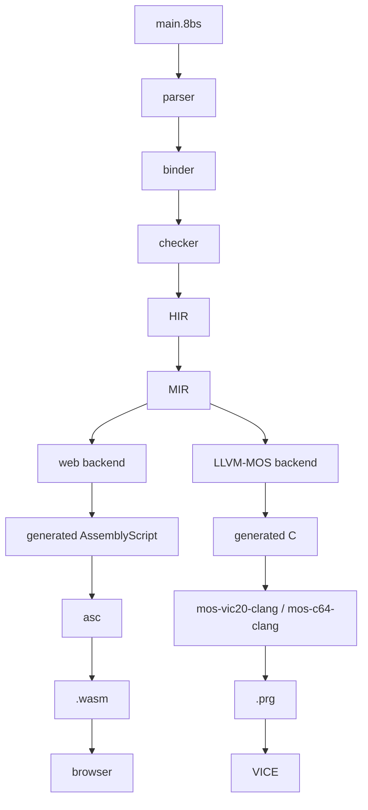

# 8BitScript

[](https://github.com/8BitScript/8bitscript/releases)
[](https://sonarcloud.io/summary/new_code?id=8BitScript_8bitscript)
[](https://sonarcloud.io/component_measures?id=8BitScript_8bitscript&metric=coverage)
[](https://sonarcloud.io/project/issues?id=8BitScript_8bitscript&resolved=false&types=CODE_SMELL)

8BitScript is a statically compiled programming language for classic 8-bit
computers and the web, using TypeScript-inspired syntax without inheriting the
managed runtime that normally comes with it.

## Project principles

- **Memory is explicit.** Layout, size, and lifetime are things you write down,
  not things the compiler decides for you behind your back.
- **Generated code is predictable.** A given construct lowers to the same shape
  every time, so you can read the output and know what the machine will do.
- **Zero hidden runtime cost.** There is no garbage collector, no boxing, and no
  implicit allocation. You pay only for what you write.
- **Portable APIs, without losing the target.** The standard APIs work the same
  on every target, and target-specific access stays available whenever you need
  the actual hardware underneath.
- **Native code is first class.** Inline assembly, external `.s` files, raw
  memory access, and platform-specific libraries are supported features of the
  language, not escape hatches bolted on the side.
- **The web build preserves native semantics.** The browser target is not a
  relaxed dialect: it honours the same memory model and the same arithmetic
  behaviour as the native build.

## Target systems

8BitScript targets the 6502 family of 8-bit machines — the processors LLVM-MOS
compiles for — plus the browser. Machines are added in phases, and the phases
are ordered so that each one forces the compiler to prove something new: first
that the language is separate from the VIC-20's hardware, then that it is not
a game language in disguise, then that it is not tied to Commodore at all.

| Phase | Targets | Goal |
| ----- | ------- | ---- |
| 0 | Web + 6502 simulator | Prove the compiler |
| 1 | VIC-20 + C64 + Web | Ship a usable 8BitScript (0.1) |
| 2 | PET + C128 | The Commodore family |
| 3 | Atari 8-bit + NES | Prove real portability |
| 4 | Commander X16 + MEGA65 | Powerful 65xx systems |
| 5 | Apple II + C16/Plus/4 + BBC Micro + Oric | Broaden the classics |
| 6 | Atari 5200 + Lynx + PC Engine + Supervision | Specialist platforms |
| 7 | Atari 2600 | Torture-test low-level control |
| 8 | Game Boy + Z80 family | First non-6502 backends |

Phase 1 is where the work is now: `web`, `vic20` and `c64` are the only
targets that exist, and together they are 8BitScript 0.1. Each phase also
names a native reference machine (C64, then C128, then Commander X16) on which
8BitScript's own development tools are written and then ported forward. The
full plan, with the reasoning behind each phase, is in
[the roadmap](docs/roadmap.md).
## Architecture



## How it compares

8BitScript sits between hand-written assembly and C on these machines, and
nowhere near BASIC.

**BASIC** (the ROM BASIC these machines shipped with) is tokenized and
interpreted: every line is re-parsed and dispatched by an interpreter loop
each time it runs. 8BitScript is compiled ahead of time to native machine
code — there is no interpreter shipped with your program and no per-line
dispatch cost at run time. An old BASIC line translates directly to a
compiler intrinsic rather than an interpreter call:

```basic
POKE 36879,27
```
```
memory.write(36879, 27);
```

**Assembly** gives you every byte and cycle, but you own register
allocation, memory layout, and stack discipline by hand, with no type
checking — nothing stops a two-byte pointer being treated as a one-byte
counter. 8BitScript keeps `asm6502` blocks, `@address` decorators, and
`memory.read`/`memory.write` as first-class language features, not
bolted-on escape hatches, so hand assembly is available inline wherever a
program actually needs it. What the compiler does *not* do is its own
register allocation or instruction selection: it generates C and hands that
to LLVM-MOS, which already does that job better than a first-generation
backend would. What 8BitScript controls instead is where every global
lives — `.rodata`, `.data`, `.noinit`, or `.zp.noinit` — decided by whether
it is `const` or `let` and how it is initialised, not left to a C-style
runtime initialiser.

**C** is the closest relative: on the 6502 targets, 8BitScript's own
ceiling is LLVM-MOS's C ceiling, because that toolchain compiles the
generated C — `mos-vic20-clang`/`mos-c64-clang`. The differences are what
8BitScript adds on top: range-checked, fixed-width integers caught at
compile time (`let score: u8 = 300;` fails to build with `300 does not fit
in u8 (0..255)` rather than silently wrapping), no `malloc` and no heap
(arrays and strings are laid out at compile time), and portable APIs —
`screen`, `text`, `input`, and so on — that resolve to each machine's own
implementation, so the same source targets nine different machines without
an `#ifdef` in sight.

### What to expect for compiled size

There is no garbage collector, no boxing, and no hidden allocation in
either 8BitScript or C, so the two stay close by construction. The gap that
does exist is measured, not guessed at — the same C64 screen (blank it,
draw a line of text, loop), built three ways and checked pixel-identical in
VICE:

| Built as | Bytes |
| --- | --- |
| Hand-written C, screen codes precomputed into a table | 178 |
| 8BitScript, `screen.blank` + `text.print` calls | 482 |
| 8BitScript, the same through `@8bitscript/ui/menubar` | 809 |

The difference is what gets computed at compile time versus run time: the
hand-written version bakes the answer for one machine into a 24-byte table;
the portable calls convert ASCII to screen codes and lay out a menu bar at
run time, because the machine and the labels aren't known until then. Full
byte-by-byte accounting is in
[docs/compiler.md](docs/compiler.md#what-a-call-costs-on-a-6502-measured).

Absolute size is bounded by the machine, not the language: `8bs build`
reports memory used after every build —

```
memory: 3 bytes of RAM for variables, 771 bytes of program (code and data)
```

— and refuses to link a program that doesn't fit, saying by how many bytes.
The unexpanded VIC-20 — the machine 8BitScript targets first — has 3583
bytes of usable RAM; the web target caps static data (arrays and string
constants) at 8192 bytes.

## What 8BitScript is not

- **Not TypeScript.** It borrows the syntax and nothing else. Existing
  TypeScript code will not compile, and a package written for Node or the
  browser cannot be imported. 8BitScript's own packages *are* distributed
  through npm — see [the package model](docs/packages.md) — but a package has
  to be written in 8BitScript to be usable from it.
- **Not an interpreter.** There is no bytecode VM and no evaluation loop
  shipped with your program; everything is compiled ahead of time.
- **Not a 6502 assembler/linker/register-allocator (LLVM-MOS does that).**
- **Not a React framework.** It has no components, no virtual DOM, and no
  reactive rendering model. The web target is a compilation target, not a UI
  library.

## Status

Nothing compiles yet. What does work is error reporting: the compiler has a
lexer, one checker rule, and a diagnostics layer, and both `8bs check` and the
language server run on them. So this reports a real error, in the terminal and
under the cursor:

```
let score: u8 = 300;
```

```
error 8BS1021: 300 does not fit in u8 (0..255)
```

Imports are checked too, against the package model: an uninstalled package or
one that is not an 8BitScript package is reported rather than failing later in
a strange way.

The first milestone compiles and runs on both targets. `8bs build` takes a
program through lexer, parser, checker, IR, linker, and a backend — generated
C and LLVM-MOS for a VIC-20 or C64 `.prg`, generated AssemblyScript and asc
for a `.wasm` — and `8bs run vic20` opens the result in VICE.
`examples/borders` cycles the
border colours on the VIC-20, the C64, *and* the web (`8bs run web` opens a
real browser tab, and `waitFrame()` means the same thing there as on the
6502 machines), importing its screen from `@8bitscript/screen` — a package whose entry
resolves per target to that machine package's own implementation.
[Studio](docs/studio.md), the asset editor that ships with the toolchain
as `@8bitscript/studio`, builds and runs on all nine too — today only its
front door, which says what each machine's tier will open.
`@8bitscript/ui` is the first of the reusable interface components a
program builds a screen out of: `@8bitscript/ui/menubar` draws a menu bar
on all nine machines from one piece of code. The active item is inverted
— reverse video, a filled bar of the item colour — via `text.setReverse`,
which each machine's text package implements (a ROM copy at ASCII+128 on
the Commodores and the NES, swapped attribute nibbles on the X16, colour
bit 7 on the web). It reports what a narrow screen could not fit rather
than overrunning the row.

`@8bitscript/input` is the capability that drives it: four directions,
confirm, cancel and a pointer, all edge-triggered, resolved per target to
that machine's own layer — a key matrix on the Commodores, a shift register
on the NES, a joystick split across two chips on the VIC-20, a 1351 mouse
on a C64 fitted with one, the KERNAL mouse on the X16. A build that did not
ask for a mouse links none of the pointer code; a machine that cannot
answer yet (the web) says so in its layer's header and costs nothing at
all. `examples/menubar` runs it everywhere and Studio's front door has one
across the top, moving under whatever the machine has.

Only a fixed subset compiles: globals and locals, arrays (`let` in RAM,
`const` as data, and passed to a function by name as
`t: array<utinyint, 4>` — the address, nothing copied, with `t.length` a
constant inside the callee), `const`s (inlined at compile time), functions
with parameters and return values, arithmetic, `if`/`while`/`for`, hardware
access, `asm6502`, namespaces, strings (literals as `string` parameters,
`string` consts, `string<N>` variables, and templates —
`text.print(0, \`TICK ${ticks:1}\`)` — laid out at compile time), and
imports, which the linker resolves across modules. Everything else —
pointers and local arrays — fails with a diagnostic naming
the construct rather than building without it. There is no binder yet, `8bs dev` is
**planned and not yet implemented**, and breaking changes arrive without
notice.

## Getting started

Install the toolchain from npm:

```bash
pnpm add -D @8bitscript/cli@0.1.0
```

Setup for LLVM-MOS and the emulators lives in
[docs/setup/index.md](docs/setup/index.md). [Install from npm](docs/install.md)
is the page for a program outside this repository.
[Building on GitHub](docs/github.md) compiles a project in Actions.
[Hosting the web target](docs/web.md) deploys `dist/web/` to Cloudflare.

## Documentation

The documentation set is built from the [`docs/`](docs/index.md) directory of
this repository and served by Cloudflare Workers at:

**https://8bitscript.org/**

That URL is live once the site has been deployed as described in
[docs/project/deployment.md](docs/project/deployment.md); until then, read the
Markdown sources in `docs/` directly, which is what the published site renders
anyway.

## File extensions

| Extension     | Contents                                                        |
| ------------- | --------------------------------------------------------------- |
| `.8bs`        | 8BitScript source                                                |
| `.ts` / `.tsx`| TypeScript source for the compiler, tooling, and web runtime      |
| `.s`          | 6502 assembly, hand-written or emitted by the LLVM-MOS backend    |

## Contributing

See [CONTRIBUTING.md](CONTRIBUTING.md) for pull requests into `trunk`, how to
add a documentation page, the documentation style rules, and how a `v*` tag
publishes npm, the editor extension, and a frozen docs snapshot.

## License

MIT. See [LICENSE](LICENSE).

## Branching

`trunk` is the default branch. New work lands through a short-lived pull
request. Releases are git tags `v0.1.0`, `v0.2.0`, … — there are no
long-lived release branches.
