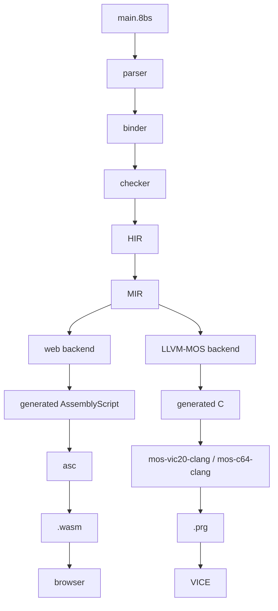

# 8BitScript

8BitScript is a statically compiled programming language for classic 8-bit
computers and the web, using TypeScript-inspired syntax without inheriting the
managed runtime that normally comes with it.

## Project principles

- **Memory is explicit.** Layout, size, and lifetime are things you write down,
  not things the compiler decides for you behind your back.
- **Generated code is predictable.** A given construct lowers to the same shape
  every time, so you can read the output and know what the machine will do.
- **Zero hidden runtime cost.** There is no garbage collector, no boxing, and no
  implicit allocation. You pay only for what you write.
- **Portable APIs, without losing the target.** The standard APIs work the same
  on every target, and target-specific access stays available whenever you need
  the actual hardware underneath.
- **Native code is first class.** Inline assembly, external `.s` files, raw
  memory access, and platform-specific libraries are supported features of the
  language, not escape hatches bolted on the side.
- **The web build preserves native semantics.** The browser target is not a
  relaxed dialect: it honours the same memory model and the same arithmetic
  behaviour as the native build.

## Target systems

8BitScript targets the 6502 family of 8-bit machines — the processors LLVM-MOS
compiles for — plus the browser. The VIC-20 is the first target and the
Commodore 64 is the second; both need to work before any other machine is worth
adding. Other 6502-family systems follow after that. Commodore is where the work
starts, not the limit of where it goes.

## Architecture



## What 8BitScript is not

- **Not TypeScript.** It borrows the syntax and nothing else. Existing
  TypeScript code will not compile, and a package written for Node or the
  browser cannot be imported. 8BitScript's own packages *are* distributed
  through npm — see [the package model](docs/packages.md) — but a package has
  to be written in 8BitScript to be usable from it.
- **Not an interpreter.** There is no bytecode VM and no evaluation loop
  shipped with your program; everything is compiled ahead of time.
- **Not a 6502 assembler/linker/register-allocator (LLVM-MOS does that).**
- **Not a React framework.** It has no components, no virtual DOM, and no
  reactive rendering model. The web target is a compilation target, not a UI
  library.

## Status

Nothing compiles yet. What does work is error reporting: the compiler has a
lexer, one checker rule, and a diagnostics layer, and both `8bs check` and the
language server run on them. So this reports a real error, in the terminal and
under the cursor:

```
let score: u8 = 300;
```

```
error 8BS1021: 300 does not fit in u8 (0..255)
```

Imports are checked too, against the package model: an uninstalled package or
one that is not an 8BitScript package is reported rather than failing later in
a strange way.

The first milestone compiles and runs on both targets. `8bs build` takes a
program through lexer, parser, checker, IR, linker, and a backend — generated
C and LLVM-MOS for a VIC-20 or C64 `.prg`, generated AssemblyScript and asc
for a `.wasm` — and `8bs run vic20` opens the result in VICE.
`examples/counter` is the milestone program; `examples/border` is one source
file that cycles the border colours on the VIC-20 *and* the C64, importing
its colour API from `@8bitscript/machine` — a package whose entry resolves
per target to the machine package underneath.

Only the milestone subset compiles: globals, parameterless functions and
calls to them, arithmetic, `if`/`while`, hardware access, `asm6502`, and
imports, which the linker resolves across modules. Everything else —
calls with arguments, member access, locals — fails with a diagnostic naming
the construct rather than building without it. There is no binder yet, `8bs dev` is
**planned and not yet implemented**, and breaking changes arrive without
notice.

## Getting started

Setup instructions for the host and retro toolchains live in
[docs/setup/index.md](docs/setup/index.md). Once that's done,
[the getting started tutorial](docs/tutorial.md) walks through cloning this
repository and building and running `examples/border` — the milestone subset
of the language, working end to end today, on the VIC-20 and the C64. From
there, [Learn 8BitScript](docs/learn/index.md) explains a program part by
part, one small runnable project per step, starting with
`examples/step1-main-loop`.

## Documentation

The documentation set is built from the [`docs/`](docs/index.md) directory of
this repository and served by Cloudflare Workers at:

**https://8bitscript.org/**

That URL is live once the site has been deployed as described in
[docs/project/deployment.md](docs/project/deployment.md); until then, read the
Markdown sources in `docs/` directly, which is what the published site renders
anyway.

## File extensions

| Extension     | Contents                                                        |
| ------------- | --------------------------------------------------------------- |
| `.8bs`        | 8BitScript source                                                |
| `.ts` / `.tsx`| TypeScript source for the compiler, tooling, and web runtime      |
| `.s`          | 6502 assembly, hand-written or emitted by the LLVM-MOS backend    |

## Contributing

See [CONTRIBUTING.md](CONTRIBUTING.md) for the trunk-only workflow, how to add a
documentation page, the documentation style rules, and how design changes are
made.

## License

MIT. See [LICENSE](LICENSE).

## Branching

This project is trunk-only: all work lands on `trunk`. There are no long-lived
feature branches and no release branches. Keep changes small enough to merge
directly.
