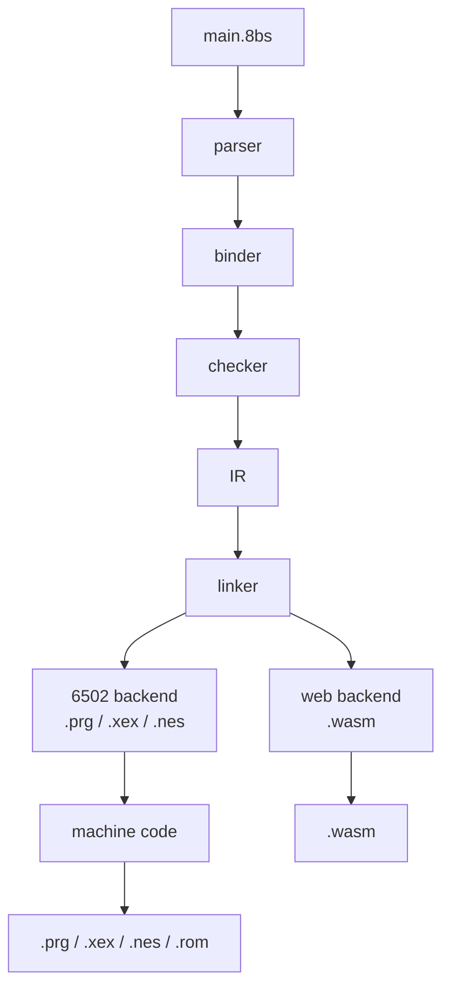

# 8BitScript

[](https://github.com/8BitScript/8bitscript/releases)
[](https://sonarcloud.io/summary/new_code?id=8BitScript_8bitscript)
[](https://sonarcloud.io/component_measures?id=8BitScript_8bitscript&metric=coverage)
[](https://sonarcloud.io/project/issues?id=8BitScript_8bitscript&resolved=false&types=CODE_SMELL)

8BitScript is a statically compiled programming language for classic 8-bit
computers and the web, using TypeScript-inspired syntax without inheriting the
managed runtime that normally comes with it.

## Project principles

- **Memory is explicit.** Layout, size, and lifetime are things you write down,
  not things the compiler decides for you behind your back.
- **Generated code is predictable.** A given construct lowers to the same shape
  every time, so you can read the output and know what the machine will do.
- **Zero hidden runtime cost.** There is no garbage collector, no boxing, and no
  implicit allocation. You pay only for what you write.
- **Portable APIs, without losing the target.** The standard APIs work the same
  on every target, and target-specific access stays available whenever you need
  the actual hardware underneath.
- **Native code is first class.** Inline assembly, external `.s` files, raw
  memory access, and platform-specific libraries are supported features of the
  language, not escape hatches bolted on the side.
- **The web build preserves native semantics.** The browser target is not a
  relaxed dialect: it honors the same memory model and the same arithmetic
  behavior as the native build.

## Target systems

8BitScript targets the 6502 family of 8-bit machines, plus the browser.
**This release builds for all nine of them.** The list is
`RELEASE_MACHINES` in the compiler's resolver, read by the CLI and the
editor rather than kept twice: PET, VIC-20, C64, C128, Commander X16,
MEGA65, Atari 8-bit, NES, and the web. 0.2.0 was the first release that
emitted at all, and it only built for the PET and the web; the other
seven have since come back with their native backends.

| Phase | Machine | Builds | Package |
| ----- | ------- | ------ | ------- |
| 1 | Web (WebAssembly) | **yes** | `@8bitscript/web` |
| 1 | VIC-20, C64 | **yes** | `@8bitscript/vic20` `@8bitscript/c64` |
| 2 | Commodore PET | **yes** | `@8bitscript/pet` |
| 2 | C128 | **yes** | `@8bitscript/c128` |
| 3 | Atari 8-bit, NES | **yes** | `@8bitscript/atari8` `@8bitscript/nes` |
| 4 | Commander X16, MEGA65 | **yes** | `@8bitscript/cx16` `@8bitscript/mega65` |

The phases are the order these nine machines were added to the workspace,
each one forcing the language to survive a hardware constraint the
previous phase didn't have — Phase 1 is the founding three, Phase 2 the
Commodore family, Phase 3 proves the language isn't CommodoreScript, Phase
4 the super-6502 machines. Five more phases (Apple II and friends through
a second CPU backend) are named but have no package yet; their research
notes are [docs/project/machines/index.md](docs/project/machines/index.md).

The sibling [2048](https://github.com/8BitScript/2048) project is the
game this toolchain is measured against: it builds, runs, and plays on
the nine.

## Architecture



## How it compares

8BitScript sits between hand-written assembly and C on these machines, and
nowhere near BASIC.

**BASIC** (the ROM BASIC these machines shipped with) is tokenized and
interpreted: every line is re-parsed and dispatched by an interpreter loop
each time it runs. 8BitScript is compiled ahead of time to native machine
code — there is no interpreter shipped with your program and no per-line
dispatch cost at run time. An old BASIC line translates directly to a
compiler intrinsic rather than an interpreter call:

```basic
POKE 36879,27
```
```
memory.write(36879, 27);
```

**Assembly** gives you every byte and cycle, but you own register
allocation, memory layout, and stack discipline by hand, with no type
checking — nothing stops a two-byte pointer being treated as a one-byte
counter. 8BitScript keeps `asm6502` blocks, `@address` decorators, and
`memory.read`/`memory.write` as first-class language features, not
bolted-on escape hatches, so hand assembly is available inline wherever a
program actually needs it. 8BitScript is also its own assembler, linker,
and register allocator — that work landed in 0.2.0, and both backends
(`mos` for the 6502 machines, `wasm` for the web) emit a real image, not
a stub. What the language already
controls is where every global lives — `.rodata`, `.data`, `.noinit`, or
`.zp.noinit` — decided by whether it is `const` or `let` and how it is
initialized, not left to a C-style runtime initializer.

**C** is the closest relative on these machines: no garbage collector, no
boxing, no hidden allocation. 8BitScript adds range-checked, fixed-width
integers caught at compile time (`let score: u8 = 300;` fails to build with
`300 does not fit in u8 (0..255)` rather than silently wrapping), no
`malloc` and no heap (arrays and strings are laid out at compile time), and
portable APIs — `screen`, `text`, `input`, and so on — that resolve to each
machine's own implementation, so the same source targets nine different
machines without an `#ifdef` in sight. It does not go through C.

### What to expect for compiled size

There is no garbage collector, no boxing, and no hidden allocation in
either 8BitScript or C, so the two stay close by construction. The gap that
does exist is measured, not guessed at — the same C64 screen (blank it,
draw a line of text, loop), built three ways and checked pixel-identical in
VICE:

| Built as | Bytes |
| --- | --- |
| Hand-written C, screen codes precomputed into a table | 178 |
| 8BitScript, `screen.blank` + `text.print` calls | 482 |
| 8BitScript, the same through `@8bitscript/ui/menubar` | 809 |

The difference is what gets computed at compile time versus run time: the
hand-written version bakes the answer for one machine into a 24-byte table;
the portable calls convert ASCII to screen codes and lay out a menu bar at
run time, because the machine and the labels aren't known until then. Full
byte-by-byte accounting is in
[docs/compiler.md](docs/compiler.md#what-a-call-costs-on-a-6502-measured).

Those byte counts were measured against the pre-0.2.0 toolchain and remain
the C64 reference; re-measure against a current `8bs build c64` before
treating them as this release's numbers.

Absolute size is bounded by the machine, not the language. `8bs build` now
prints memory used for real —

```
memory: 101 bytes of RAM for variables, 1132 bytes of program (code and data)
```

for `packages/examples/hello-world` on the PET, and

```
memory: 2 bytes of RAM for variables, 13 bytes of constant data (as declared)
```

on the web — and refuses to link a program that doesn't fit, saying by how
many bytes. The unexpanded VIC-20 — the next machine in line once the PET's
own backend proved itself — has 3583 bytes of usable RAM; the web target
caps static data (arrays and string constants) at 8192 bytes.

## What 8BitScript is not

- **Not TypeScript.** It borrows the syntax and nothing else. Existing
  TypeScript code will not compile, and a package written for Node or the
  browser cannot be imported. 8BitScript's own packages *are* distributed
  through npm — see [the package model](docs/packages.md) — but a package has
  to be written in 8BitScript to be usable from it.
- **Not an interpreter.** There is no bytecode VM and no evaluation loop
  shipped with your program; everything is compiled ahead of time.
- **It is a 6502 assembler, linker, and register allocator** — that work
  landed in 0.2.0, and both backends emit for every machine in
  `RELEASE_MACHINES`.
- **Not a React framework.** It has no components, no virtual DOM, and no
  reactive rendering model. The web target is a compilation target, not a UI
  library.

## Status

**All nine machines in `RELEASE_MACHINES` build, run, and render.** The
front end through the linker exists. Two backends live in
`@8bitscript/compiler` — `mos` and `wasm` — and both emit: `mos` generates
real 6502 opcodes (a `.prg`, `.xex`, or `.nes`), `wasm` generates a real
WebAssembly module for the browser. `8bs build` and `8bs run` work end to
end for PET, VIC-20, C64, C128, Commander X16, MEGA65, Atari 8-bit, NES,
and the web. `8bs check` and the language server run for every target, so
this reports a real error in the terminal and under the cursor:

```
let score: u8 = 300;
```

```
error 8BS1021: 300 does not fit in u8 (0..255)
```

Imports are checked too, against the package model: an uninstalled package or
one that is not an 8BitScript package is reported rather than failing later in
a strange way.

The compiled subset lowers to IR: globals and locals, arrays (`let` in RAM,
`const` as data, and passed to a function by name as
`t: array<utinyint, 4>` — the address, nothing copied, with `t.length` a
constant inside the callee), `const`s (inlined at compile time), functions
with parameters and return values, arithmetic, `if`/`while`/`for`, hardware
access, `asm6502`, namespaces, strings (literals as `string` parameters,
`string` consts, `string<N>` variables, and templates —
`text.print(0, \`TICK ${ticks:1}\`)` — laid out at compile time), and
imports, which the linker resolves across modules. Everything else —
pointers and local arrays — fails with a diagnostic naming
the construct rather than lowering without it. There is no binder yet, `8bs
dev` is **planned and not yet implemented**, and breaking changes arrive
without notice.

`@8bitscript/screen`, `@8bitscript/text`, `@8bitscript/input`,
`@8bitscript/ui/menubar`, and [Studio](docs/studio.md) exist as packages —
portable surfaces that resolve per target to that machine's own
implementation. They produce a real image on every machine in
`RELEASE_MACHINES`. `@8bitscript/raster` is the same kind of surface for
per-scanline effects — a border split, a background band, a horizontal
wobble; the C64 and the web are the two machines with a real
implementation, and everywhere else `#fact(video.raster)` answers false,
so a guarded effect folds away entirely instead of shipping inert.

## Getting started

Install the toolchain from npm:

```bash
pnpm add -D @8bitscript/cli@0.9.0
```

Setup is emulators only — [docs/setup/index.md](docs/setup/index.md). There
is no external 6502 SDK. [Install from npm](docs/install.md) is the page for
a program outside this repository. `8bs build` and `8bs run` work for every
machine in `RELEASE_MACHINES`. [Building on GitHub](docs/github.md) is the
same: the reusable workflow installs the CLI and builds. [Hosting the web
target](docs/web.md) deploys `dist/web/` to Cloudflare.

## Documentation

The documentation set is built from the [`docs/`](docs/index.md) directory of
this repository and served by Cloudflare Workers at:

**https://8bitscript.org/**

That URL is live once the site has been deployed as described in
[docs/project/deployment.md](docs/project/deployment.md); until then, read the
Markdown sources in `docs/` directly, which is what the published site renders
anyway.

## File extensions

| Extension     | Contents                                                        |
| ------------- | --------------------------------------------------------------- |
| `.8bs`        | 8BitScript source                                                |
| `.8bx`        | 8BitScript source plus 8BX element and `component` syntax; importable and twin-able like `.8bs`. The 8BX spec makes the program entry `.8bs`; the toolchain does not enforce that yet |
| `.ts` / `.tsx`| TypeScript source for the compiler, tooling, and web runtime      |
| `.s`          | Hand-written 6502 assembly the compiler will include; the backend does not emit `.s` files yet |

## Contributing

See [CONTRIBUTING.md](CONTRIBUTING.md) for pull requests into `trunk`, how to
add a documentation page, the documentation style rules, and how a `v*` tag
publishes npm, the editor extension, and a frozen docs snapshot.

## License

MIT. See [LICENSE](LICENSE).

## Branching

`trunk` is the default branch. New work lands through a short-lived pull
request. Releases are git tags `v0.1.0`, `v0.2.0`, …. The `release`
branch is fast-forwarded to the tagged commit only after npm has that
version, so it names what is actually downloadable.
